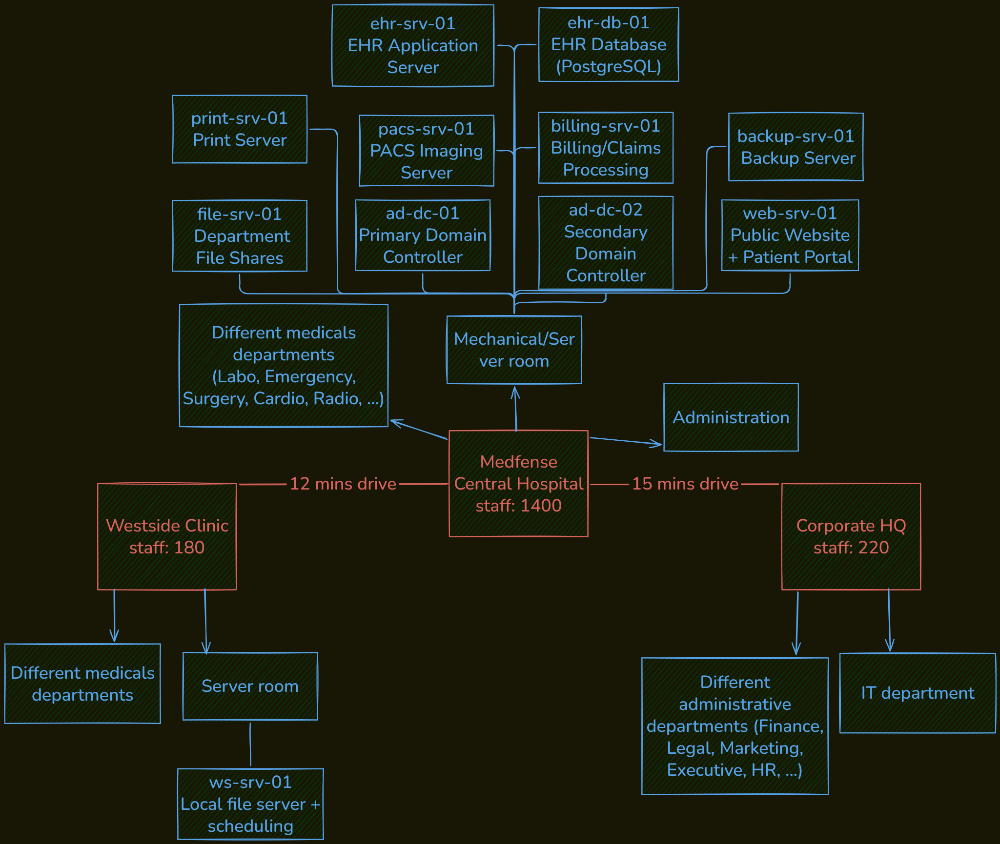

# 0. The Onboarding Packet

## Introduction

### Goal
Extract a structured understanding of an organization from incomplete and disorganized documentation.

### Context
James Chen hands you a folder labeled "MedDefense, Security Documentation." It contains everything the organization has: a partial IT asset list exported from the ticketing system, an outdated network diagram that Marcus started but never finished, a one-page org chart, site descriptions from the HR onboarding guide, notes Marcus left in a text file on the shared drive, and a summary of IT service contracts.

None of it is complete. Some of it contradicts itself. Welcome to reality.

---

# Structured Environment Summary

## 1. Organization Overview



### Sites

| Site | Location Type | Primary Function | Approximate Headcount |
|:---|:---|:---|:---:|
| **MedDefense Central Hospital** | Downtown acute-care hospital | Main clinical facility, data center, core IT infrastructure | ~1,400 |
| **Westside Clinic** | Suburban outpatient clinic | Primary care, diagnostics, physical therapy, minor procedures | ~180 |
| **Corporate HQ** | Greenfield Business Park (leased office) | Administration, executive leadership and IT department | ~220 |

**Total organization-wide employees:** ~2,000

### Departments

#### MedDefense Central Hospital
- Emergency
- Surgery
- Cardiology
- Radiology
- Oncology
- Pediatrics
- Maternity
- Pharmacy
- Laboratory
- Administration

#### Westside Clinic
- Primary Care
- Diagnostic Imaging (X-ray, Ultrasound)
- Blood Work
- Minor Procedures
- Physical Therapy

#### Corporate HQ
- Finance
- Human Resources
- Legal
- Marketing
- Executive Leadership
- IT

### Security and IT Reporting Structure

```
CEO (Dr. Patricia Morales)
│
├── CFO (Robert Kim)
├── COO (Angela Torres)
│    └── Clinical Directors
├── General Counsel (David Park)
└── CISO (Vacant)
     │
     ├── James Chen (Deputy CISO - Acting)
     │      └── Security Analyst (You)
     │
     └── Sarah Park (IT Director)
            ├── 3 System Administrators
            ├── 2 Network Technicians
            ├── 1 Database Administrator
            ├── 2 Helpdesk Analysts
            ├── 2 Desktop Support Technicians
            └── 1 Vacant IT Intern
```

### Security Governance Notes

- The CISO position is vacant.
- James Chen reports directly to the CEO in practice.
- James has authority over security policy.
- Sarah Park has authority over IT operations.
- Security and IT are peer organizations, creating operational friction.

---

## 2. IT Infrastructure Identified

### Servers

| Server name | Function | Location | Technical details |
|:---|:---|:---|:---|
| ehr-srv-01 | EHR Application Server | MedDefense Central | Ubuntu 20.04 LTS |
| ehr-db-01 | EHR Database (PostgreSQL) | MedDefense Central | Ubuntu 20.04 LTS |
| pacs-srv-01 | PACS Imaging Server | MedDefense Central | Windows Server 2016 |
| billing-srv-01 | Billing / Claims Processing | MedDefense Central | Ubuntu 18.04 LTS |
| ad-dc-01 | Primary Domain Controller | MedDefense Central | Windows Server 2019 |
| ad-dc-02 | Secondary Domain Controller | MedDefense Central | Windows Server 2019 |
| file-srv-01 | Department File Shares | MedDefense Central | Windows Server 2016 |
| print-srv-01 | Print Server *(unverified)* | MedDefense Central | Windows Server 2012 R2 (End of Support) |
| backup-srv-01 | Backup Server (Veeam Agent) | MedDefense Central | Ubuntu 22.04 LTS |
| web-srv-01 | Public Website & Patient Portal (DMZ) | MedDefense Central | Ubuntu 20.04 LTS |
| ws-srv-01 | Local File Server & Scheduling | Westside Clinic | Windows Server 2016 |
| Unknown server | Unknown | Westside Clinic | Mentioned but never verified |

### Network Infrastructure

#### MedDefense Central

- Fortinet FortiGate 100F firewall
- Cisco core switch (model unknown)
- Two Cisco access switches per floor
- 12 Ubiquiti UniFi wireless access points
- Flat 10.10.0.0/16 network
- No VLAN segmentation
- Guest Wi-Fi (isolation not verified)
- DMZ hosting the public web server

#### Westside Clinic

- Consumer Netgear Nighthawk router
- One unmanaged network switch
- IPSec site-to-site VPN to Central
- Local server closet

#### Corporate HQ

- Building-managed network
- Dedicated MedDefense VLAN
- Site-to-site VPN to Central
- No on-premise servers

### Endpoints

#### Workstations

| Site | Devices |
|:---|:---|
| Central | ~320 Windows 10 PCs |
| Central | ~60 Thin Clients |
| Westside | ~45 Windows 10 PCs |
| HQ | ~120 Windows 10/11 PCs |
| HQ | ~30 Laptops |

### Mobile Devices

- ~25 physician iPads
- Management status unknown

### Medical Devices (IoT)

| Device | Quantity | Notes |
|:---|:---:|:---|
| Philips IntelliVue Patient Monitors | ~80 | Network connected |
| BD Alaris Infusion Pumps | ~120 | Network connected |
| Siemens MAGNETOM MRI | 1 | Runs Windows XP |
| GE Revolution CT Scanner | 1 | Operating system unknown |
| Nurse Call System | Unknown | IP-based, integrated with phone system |
| HID Global Badge System | Unknown | Connected to Active Directory for some doors |

### Storage and Backup

- Veeam backup server
- Local NAS
- NAS located in same server room and rack as production systems
- No off-site or cloud backup

### Cloud Services

- Microsoft 365 E3
- Patient Portal
- Public Website
- Possible additional cloud services (inventory incomplete)

### Security Infrastructure

- Sophos Endpoint Protection
- Fortinet FortiGate support contract
- HID badge access system
- ClearView Security guard service (Central only)

---

## 3. Data and Services

### Data Managed

#### Clinical Data

- Electronic Health Records (EHR)
- Patient demographics
- Clinical notes
- Medication information
- Diagnostic imaging
- Laboratory results
- Radiology records
- Appointment schedules

#### Financial Data

- Billing records
- Insurance claims
- Finance department records

#### Administrative Data

- HR information
- Legal documentation
- Marketing data
- Executive documents

#### Authentication Data

- Active Directory accounts
- User credentials
- Badge access information

### Critical IT Services

| Service | Supporting Infrastructure | Primary Users |
|:---|:---|:---|
| Electronic Health Record (EHR) | ehr-srv-01, ehr-db-01 | Physicians, Nurses, Clinical Staff |
| PACS Imaging | pacs-srv-01 | Radiology Department |
| Billing & Claims | billing-srv-01 | Finance, Billing Staff |
| Active Directory | ad-dc-01, ad-dc-02 | Entire Organization |
| Department File Shares | file-srv-01 | All Departments |
| Printing | print-srv-01 | Organization-wide |
| Patient Portal | web-srv-01 | Patients, Clinical Staff |
| Website | web-srv-01 | Public |
| Backup Services | backup-srv-01, NAS | IT Department |
| Scheduling | ws-srv-01 | Westside Clinic Staff |
| Badge Access | HID + AD | Employees |
| Nurse Call System | IP Infrastructure | Nursing Staff |
| Site-to-site VPN | FortiGate / Netgear | Westside and HQ Staff |
| Microsoft 365 | Cloud | Entire Organization |

### Users of IT Systems

- Physicians
- Nurses
- Clinical Directors
- Laboratory Staff
- Pharmacy Staff
- Radiology Staff
- Administrative Staff
- Finance Department
- HR Department
- Legal Department
- Executive Leadership
- IT Department
- Patients (Patient Portal)
- Visitors (Guest Wi-Fi)

---

## 4. Known Unknowns

### Asset Inventory

- Complete server inventory is unavailable.
- Possible second server at Westside has never been confirmed.
- Complete endpoint inventory is unavailable.
- Current workstation counts are based on an 8-month-old AD report.
- Management status of physician iPads is unknown.

### Network

- Cisco core switch model unknown.
- Westside Wi-Fi infrastructure unknown.
- Guest Wi-Fi isolation has not been verified.
- HQ VPN ACLs have never been audited.
- Real network topology is more complex than documented.
- VLAN segmentation is absent but future implementation status is unknown.

### Infrastructure

- CT scanner operating system unknown.
- Number of nurse call system components unknown.
- Number of HID access control devices unknown.
- Print server has not been physically verified for over a year.

### Security

- No formal vulnerability assessment completed.
- Endpoint protection deployment status unknown.
- No cloud service inventory beyond Microsoft 365.
- No completed threat landscape assessment.
- No HIPAA Security Rule assessment has been performed.
- No formal Incident Response Plan exists.
- No Business Continuity Plan exists.
- No Disaster Recovery Plan exists.

### Authentication

- Extent of shared accounts outside Radiology unknown.
- SSH migration to key-based authentication incomplete.
- MFA deployed only for James Chen's personal account.

### Physical Security

- Physical security of Westside server closet unverified beyond Marcus' notes.
- No server room corridor cameras.
- Badge access permissions have not been reviewed.

### Backup & Recovery

- Backup restoration process not documented.
- Backup testing schedule unknown.
- Recovery Time Objectives (RTO) unknown.
- Recovery Point Objectives (RPO) unknown.

### Compliance

- Compliance evidence is lacking despite legal claiming HIPAA compliance.
- Security policies and procedures are not documented in the onboarding material.

### Documentation Gaps

- Network addressing outside 10.10.0.0/16 not documented.
- Firewall rules are undocumented.
- Server patch levels unknown.
- Database version unknown.
- Public website architecture undocumented.
- Patient portal authentication method unknown.
- Complete software inventory unavailable.
- Medical device firmware versions unknown.
- Vendor support status for medical devices unknown.
- Contradictions and outdated information may exist throughout the documentation package and require field verification.